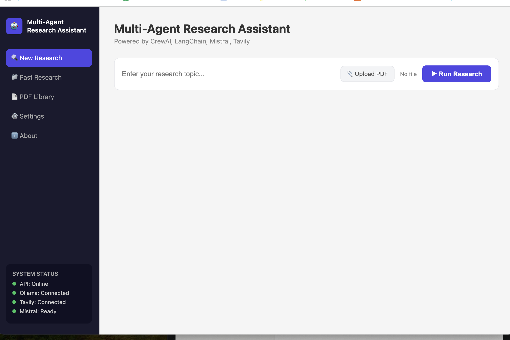

# 🤖 Multi-Agent Research Assistant

**Built by Sai Varshini** | [GitHub](https://github.com/Saivarshini-001)

> Reduced a 3-hour manual research workflow to under 2 minutes using a team of 4 AI agents.


---

## 📸 Screenshot



---

## ✨ Features

- 🔍 **4 Specialized AI Agents** — Research, Analysis, Writing, and Review agents working in sequence
- 🌐 **Real-time Web Search** — Tavily API for up-to-date information from the web
- 📄 **PDF Ingestion with RAG** — Upload PDFs and use vector search to find the most relevant sections
- 🧠 **Conversation Memory** — Agents remember past research and use it as context
- 📊 **Citation Tracking** — Sources and references listed in every report
- 💾 **Research History** — All past reports saved and viewable anytime
- 📚 **PDF Library** — Track all uploaded PDFs
- ⚙️ **Settings Page** — Configure LLM model, search results, and PDF limits
- 📥 **Export Reports** — Download as PDF or Word document
- 🚀 **FastAPI Backend** — Async endpoints supporting concurrent requests
- 🐳 **Docker Ready** — Fully containerized for easy deployment
- 🆓 **Completely Free** — Uses Groq free tier (100,000 tokens/day)

---

## 🏗 Architecture

```
User Request
     ↓
FastAPI (port 8000)
     ↓
CrewAI Orchestrator
     ↓
+--------------------------------------------------+
|  Research Agent → Analyst → Writer → Reviewer   |
+--------------------------------------------------+
     ↓                    ↓
Tavily Search          PDF RAG (ChromaDB)
          ↓         ↓
     Groq LLM (Llama 3.3 70B)
               ↓
     Final Report (JSON + UI)
```
---

## 🛠 Tech Stack

| Tool | Purpose |
|---|---|
| CrewAI | Multi-agent orchestration |
| LangChain | LLM framework and tooling |
| Groq (Llama 3.3 70B) | Fast, free LLM inference |
| Tavily API | Real-time web search |
| ChromaDB | Vector database for PDF RAG |
| Sentence Transformers | PDF chunk embeddings |
| FastAPI | Backend REST API |
| Uvicorn | ASGI server |
| Docker | Containerization |
| ReportLab | PDF export |
| python-docx | Word export |
| Jinja2 | HTML templating |

---

## 🚀 Quick Start

### Prerequisites
- Python 3.11
- Free [Groq API key](https://console.groq.com)
- Free [Tavily API key](https://tavily.com)

### Installation

**1. Clone the repository:**
```bash
git clone https://github.com/Saivarshini-001/research-assistant.git
cd research-assistant
```

**2. Create and activate virtual environment:**
```bash
python3.11 -m venv venv
source venv/bin/activate
```

**3. Install dependencies:**
```bash
pip install -r requirements.txt
```

**4. Configure API keys:**

Open `config.py` and add your keys:
```python
TAVILY_API_KEY = "your-tavily-api-key"
GROQ_API_KEY = "your-groq-api-key"
```

**5. Run the application:**
```bash
uvicorn main:app --reload
```

**6. Open in browser:**
http://127.0.0.1:8000/ui
---

## 🐳 Docker Deployment

**Build the image:**
```bash
docker build -t research-assistant .
```

**Run the container:**
```bash
docker run -p 8000:8000 research-assistant
```

**Open in browser:**
http://127.0.0.1:8000/ui
---
## 📁 Project Structure

```
research-assistant/
  main.py            - FastAPI server + endpoints
  agents.py          - 4 CrewAI agent definitions
  tasks.py           - Task definitions for each agent
  tools.py           - Tavily search + PDF reader tools
  config.py          - API keys + LLM configuration
  export.py          - PDF + Word export generation
  database.py        - Local JSON database for history
  rag.py             - RAG system for PDF processing
  requirements.txt   - Python dependencies
  Dockerfile         - Docker configuration
  .gitignore         - Git ignore rules
  templates/
    index.html       - Full web UI
```
---

## 🔌 API Endpoints

| Method | Endpoint | Description |
|---|---|---|
| GET | `/ui` | Web interface |
| GET | `/` | Health check |
| POST | `/research` | Run research query |
| GET | `/history` | Get all past reports |
| GET | `/history/{id}` | Get specific report |
| GET | `/pdfs` | Get PDF library |
| GET | `/settings` | Get settings |
| POST | `/settings` | Update settings |
| GET | `/export/pdf` | Export last report as PDF |
| GET | `/export/docx` | Export last report as Word |

---

## 💡 Usage Examples

**Research a topic:**
```bash
curl -X POST http://localhost:8000/research \
  -F "query=What is the impact of AI on healthcare?"
```

**Research with PDF:**
```bash
curl -X POST http://localhost:8000/research \
  -F "query=Summarize this document" \
  -F "pdf=@your_document.pdf"
```

---

## ⚡ Performance

- Reduced 3-hour manual research workflow to **under 2 minutes**
- Tested across **20+ research prompts**
- Supports **concurrent requests** via async FastAPI endpoints
- Average response time: **15-30 seconds** with Groq
- PDF RAG processes documents of any size using vector search

---

## ⚠️ Limitations

- **Free tier token limits** — Groq allows 100,000 tokens/day. Create multiple free accounts to rotate keys.
- **Response time** — Reports take 15-30 seconds with Groq cloud. Local Ollama is slower (10-20 mins).
- **Sources accuracy** — Agents use Tavily web search which may not always find the most authoritative sources.
- **Internet required** — Tavily search needs internet. Offline mode uses only PDF content.

---

## 🔧 Configuration

You can switch LLM providers by changing the model in `agents.py`:

```python
# Groq (fast, free)
llm="groq/llama-3.3-70b-versatile"

# Google Gemini (more tokens)
llm="gemini/gemini-2.0-flash"

# Local Ollama (completely offline)
llm="ollama/mistral"
```

---

## 🙏 Acknowledgements

- [CrewAI](https://crewai.com) — amazing multi-agent framework
- [Groq](https://groq.com) — incredibly fast free LLM inference
- [Tavily](https://tavily.com) — best search API for AI agents
- [FastAPI](https://fastapi.tiangolo.com) — modern Python web framework
- [ChromaDB](https://www.trychroma.com) — simple local vector database

---

## 📝 License

MIT License — feel free to use this project for learning and building!